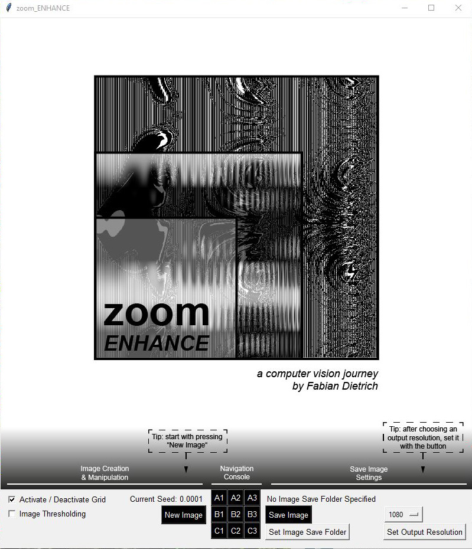
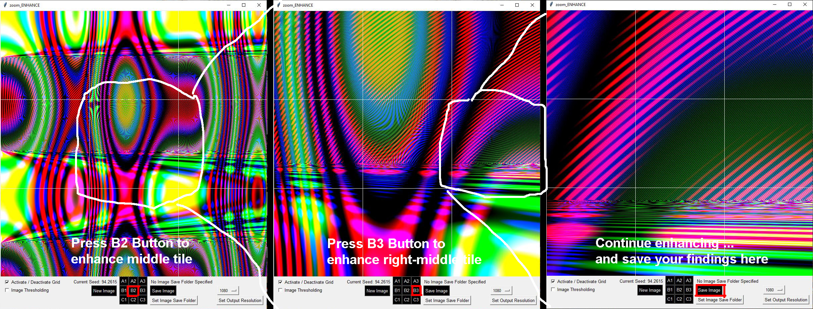
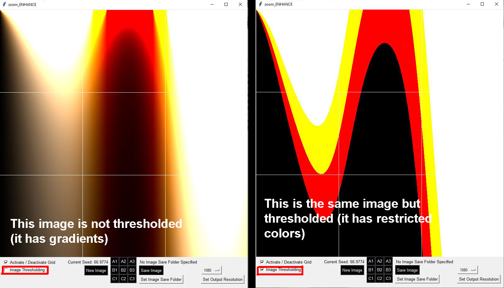

# Zoom_Enhance
**Create, Zoom into, and lose yourself in algorithmic art with this Graphic User Interface**
- Create unique abstract high-resolution algorithmic images
- Zoom into the images as deep as you want
- Toggle between full color space, and 8-color thresholding
- Save your favorite pictures (resolutions from 10x10px to 2560x2560px supported)

## How to Run
**Option A - Quick & Simple (recommended for most users)**
1. Download the file zoom_enhance.exe from [my website](https://www.fabiandietrich.com/static/code/zoom_enhance.exe) (it is 27MB which is more than Github allows)
2. Run the file (on Windows). To run the program this way, you do not need python or other dependencies installed. Depending on your antivirus software, you might get a warning when trying to run the file. If you don't trust the .exe, you can also run the program by following Option B below

**Option B - Custom**
1. Clone the repository
2. Make sure you have the following modules installed:
	- opencv-python
	- pillow
	- numpy
	- tkinter
3. Run zoom_enhance.py (requires Python 3)

## Inspiration
I experimented for a long time writing and using different Python scripts to create algorithmic art. Eventually, I wanted a more intuitive graphic user interface to be able to better direct my program. When creating abstract images based on a seed, the zoom factor can usually be chosen (almost) arbitrarily. As a Bladerunner fan, I remembered the iconic [enhance scene](https://www.youtube.com/watch?v=hHwjceFcF2Q), in which Harrison Ford is able to retrieve visual information from the depths of an endlessly magnified picture.

## Credit
The underlying image generation algorithm that I used for this project is from Nathan Reed's post ['Generating Abstract Images with Random Functions'](http://reedbeta.com/blog/generating-abstract-images-with-random-functions/).
